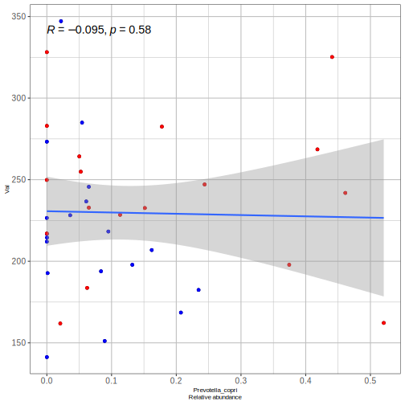
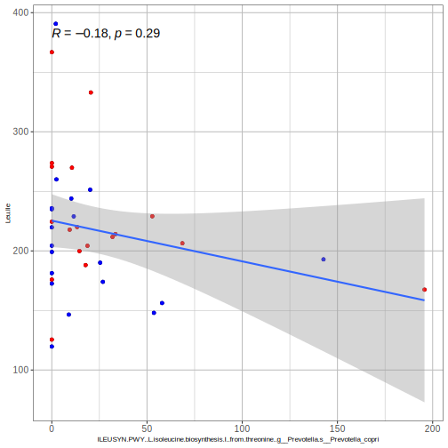

## Muestras utilizadas (n=38)

sample|group
-|-
RL514-mf|Control
RL516-mf|Control
RL518-mf|NASH
RL528-mf|NASH
RL568-mf|NASH
RL569-mf|Control
RL573-mf|Control
RL585-mf|Control
RL591-mf|NASH
RL601-mf|NASH
RL605-mf|NASH
RL606-mf|NASH
RL607-mf|Control
RL610-mf|Control
RL613-mf|NASH
RL616-mf|NASH
RL627-mf|Control
RL628-mf|Control
RL641-mf|NASH
RL651-mf|Control
RL654-mf|Control
RL656-mf|NASH
RL659-mf|NASH
RL663-mf|NASH
RL665-mf|NASH
RL667-mf|NASH
RL668-mf|NASH
RL679-mf|NASH
RL680-mf|Control
RL683-mf|NASH
RL686-mf|Control
RL691-mf|Control
RL693-mf|Control
RL700-mf|Control
RL703-mf|Control
RL704-mf|Control
RL725-mf|Control

## Correlaciones Prevotella copri vs aminoacidos

## Correlaciones de Prevotella copri con síntesis y catálisis de aminoácidos

Estas son las funciones de Prevotella copri encontradas en el metatranscriptoma:

1. ILEUSYN-PWY: L-isoleucine biosynthesis I (from threonine)|g__Prevotella.s__Prevotella_copri
2. PWY-5103: L-isoleucine biosynthesis III|g__Prevotella.s__Prevotella_copri
3. VALSYN-PWY: L-valine biosynthesis|g__Prevotella.s__Prevotella_copri

## Correlaciones Prevotella vs aminoácidos

## Correlaciones Prevotella vs aminoácidos, removiendo muestras con 0% en abundancia

## Correlaciones Butyrivibrio vs aminoácidos

## Correlaciones Butyrivibrio vs aminoácidos, removiendo muestras con 0% en abundancia

## Correlaciones Megasphaera vs aminoácidos

## Correlaciones Megasphaera vs aminoácidos, removiendo muestras con 0% en abundancia

# Correlaciones con síntesis y catálisis de aminoácidos

## Val

## Leu/Ile

## Phe

## Tyr

