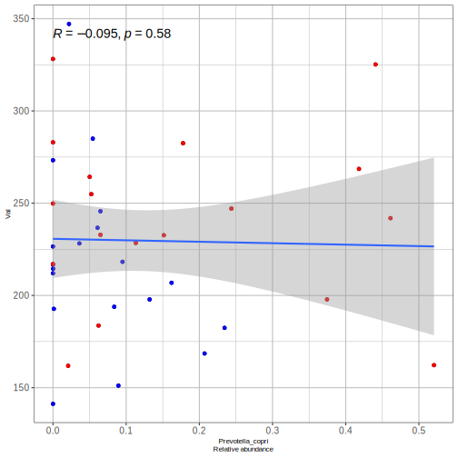
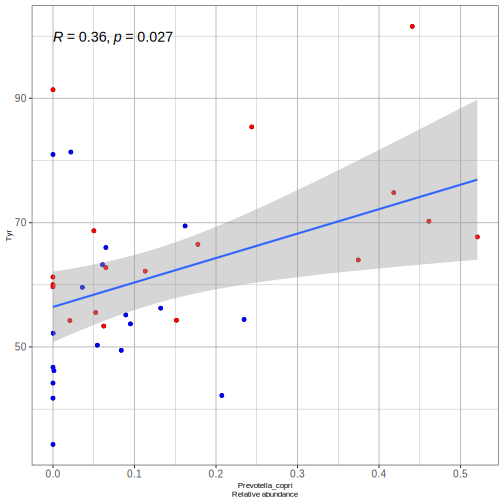
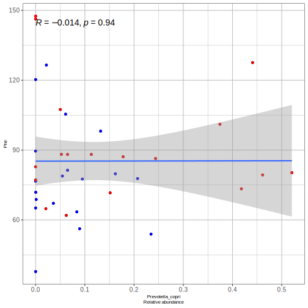
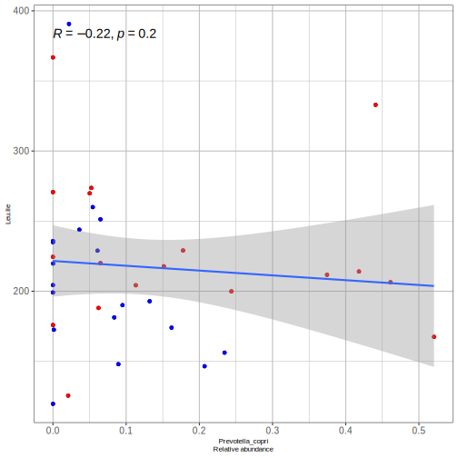
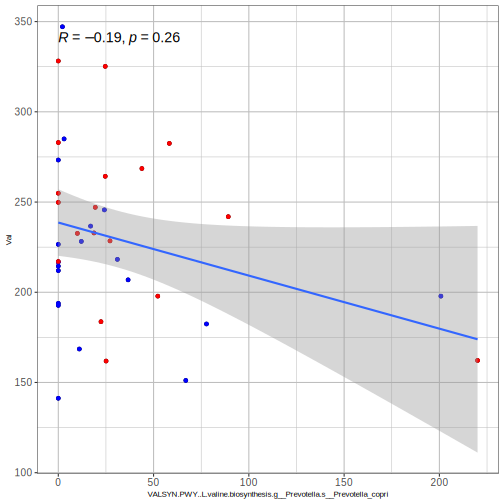
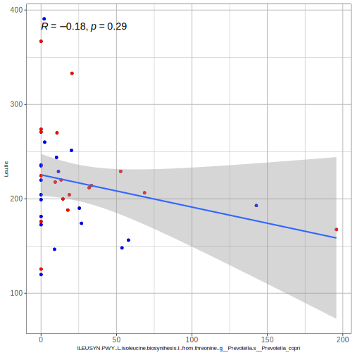

## Prevotella copri entre grupos

## Correlaciones Prevotella copri vs aminoacidos

## Correlaciones de Prevotella copri con síntesis y catálisis de aminoácidos

Estas son las funciones de Prevotella copri encontradas en el metatranscriptoma:

1. ILEUSYN-PWY: L-isoleucine biosynthesis I (from threonine)|g__Prevotella.s__Prevotella_copri
2. PWY-5103: L-isoleucine biosynthesis III|g__Prevotella.s__Prevotella_copri
3. VALSYN-PWY: L-valine biosynthesis|g__Prevotella.s__Prevotella_copri

## Correlaciones de Tirosina con otras rutas metabólicas Prevotella copri

